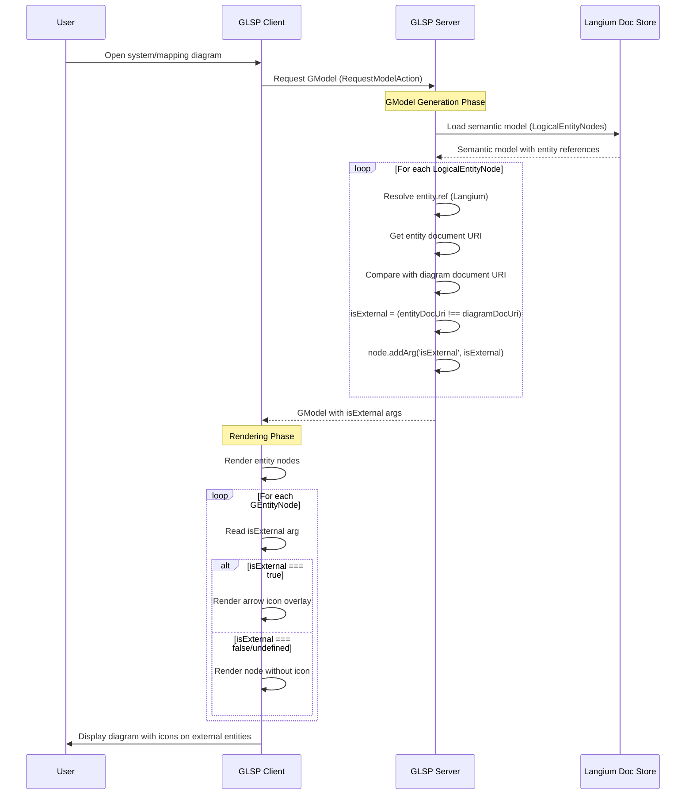

# EXTERNAL-ENTITY-ICON Interface Contract

## Overview
Defines the contract between GLSP Server (backend) and GLSP Client (frontend) for communicating whether an entity node is external (from another model or npm package).

## Affected Components
- **Frontend:** `packages/glsp-client` - Renders arrow icon based on flag
- **Backend:** `packages/server/src/glsp-server` - Adds `isExternal` flag to GModel

## GModel Property Extension

### Entity Node Args Extension

The backend GLSP server will add an `isExternal` argument to entity `GNode` instances using the existing Args mechanism.

```typescript
// Backend: packages/server/src/glsp-server/system-diagram/model/nodes.ts
// and packages/server/src/glsp-server/mapping-diagram/model/nodes.ts

export class GEntityNodeBuilder extends GNodeBuilder<GEntityNode> {
    set(node: LogicalEntityNode, index: ModelIndex): this {
        // ... existing code ...

        // NEW: Add isExternal flag based on entity reference resolution
        const isExternal = this.isEntityExternal(node, index);
        this.addArg('isExternal', isExternal);

        return this;
    }

    /**
     * Determines if an entity is external (from another model or npm package).
     * An entity is considered external if its document URI differs from the
     * current diagram's document URI.
     */
    protected isEntityExternal(node: LogicalEntityNode, index: ModelIndex): boolean {
        // Get the entity reference
        const entityRef = node.entity?.ref;
        if (!entityRef) {
            return false; // Unresolved reference, not external
        }

        // Get document URI of the referenced entity
        const entityDocumentUri = entityRef.$document?.uri?.toString();
        if (!entityDocumentUri) {
            return false;
        }

        // Get document URI of the current diagram
        const diagramDocumentUri = index.getDiagramDocumentUri();

        // Compare URIs: external if different
        return entityDocumentUri !== diagramDocumentUri;
    }
}
```

### Args Property Definition

```typescript
// Property added via Args mechanism
interface EntityNodeArgs {
    // ... existing args ...
    isExternal?: boolean;  // NEW: Flag indicating entity is from another model
}
```

## Service Responsibilities

### GLSP Server (Backend)

**Handles:**
- Entity reference resolution (already exists via Langium)
- Document URI comparison to determine local vs. external
- Adding `isExternal` arg to GModel entity nodes

**Modified Files:**
- `packages/server/src/glsp-server/system-diagram/model/nodes.ts`
  - Update `GEntityNodeBuilder.set()` to add `isExternal` arg
- `packages/server/src/glsp-server/mapping-diagram/model/nodes.ts`
  - Update entity node builder to add `isExternal` arg

**Logic:**
```typescript
function isEntityExternal(entityNode: LogicalEntityNode, modelIndex: ModelIndex): boolean {
    const entityRef = entityNode.entity?.ref;
    if (!entityRef || !entityRef.$document) {
        return false;
    }

    const entityDocUri = entityRef.$document.uri.toString();
    const diagramDocUri = modelIndex.getDiagramDocumentUri();

    // External if from different document
    return entityDocUri !== diagramDocUri;
}
```

**Properties Set:**
- `isExternal: true` - Entity is from another workspace file or npm package
- `isExternal: false` or `undefined` - Entity is local to current model

### GLSP Client (Frontend)

**Handles:**
- Reading `isExternal` arg from GModel entity nodes
- Rendering arrow icon overlay when `isExternal === true`
- Scaling icon with entity node
- Positioning icon in bottom-left corner

**Modified Files:**
- `packages/glsp-client/src/browser/system-diagram/views/entity-node-view.tsx` (new file)
  - React/JSX view for rendering entity nodes with icon overlay
- `packages/glsp-client/src/browser/mapping-diagram/views/entity-node-view.tsx` (new file)
  - Similar view for mapping diagrams
- `packages/glsp-client/src/browser/system-diagram/system-diagram-configuration.ts`
  - Register custom view for entity nodes
- `packages/glsp-client/src/browser/mapping-diagram/mapping-diagram-configuration.ts`
  - Register custom view for entity nodes

**Logic:**
```typescript
// Frontend reads the arg
function renderEntityNode(node: GEntityNode): VNode {
    const isExternal = ArgsUtil.getBoolean(node, 'isExternal', false);

    return (
        <g>
            {/* Entity node rendering */}
            <rect class="entity-node" .../>

            {/* Arrow icon overlay (conditional) */}
            {isExternal && (
                <g class="external-entity-icon" transform={`translate(5, ${node.bounds.height - 20})`}>
                    {/* Arrow SVG path */}
                    <path d="M0,10 L10,0 L10,10 Z" fill="white" stroke="black" stroke-width="1"/>
                </g>
            )}
        </g>
    );
}
```

## Communication Flow

### Sequence Diagram



## Data Structure Examples

### Backend: GModel with isExternal

```json
{
  "type": "graph",
  "id": "root",
  "children": [
    {
      "type": "node:entity",
      "id": "entity_Customer",
      "position": { "x": 100, "y": 100 },
      "size": { "width": 120, "height": 100 },
      "args": {
        "referenceContainer": "LogicalEntityNode",
        "referenceProperty": "entity",
        "referenceValue": "Customer",
        "isExternal": false
      },
      "children": [ /* labels, compartments */ ]
    },
    {
      "type": "node:entity",
      "id": "entity_Order",
      "position": { "x": 300, "y": 100 },
      "size": { "width": 120, "height": 100 },
      "args": {
        "referenceContainer": "LogicalEntityNode",
        "referenceProperty": "entity",
        "referenceValue": "Order",
        "isExternal": true
      },
      "children": [ /* labels, compartments */ ]
    }
  ]
}
```

### Frontend: Reading isExternal

```typescript
import { ArgsUtil } from '@eclipse-glsp/client';

function processEntityNode(node: GEntityNode): void {
    // Read isExternal arg (default to false if not present)
    const isExternal = ArgsUtil.getBoolean(node, 'isExternal', false);

    if (isExternal) {
        // Render with arrow icon overlay
        renderExternalEntityIcon(node);
    }
}
```

## Icon Visual Specification

### SVG Arrow Icon

```svg
<!-- Arrow pointing up-right (Windows-style shortcut arrow) -->
<svg width="15" height="15" viewBox="0 0 15 15" class="external-entity-icon">
  <!-- White background for visibility -->
  <rect x="0" y="5" width="10" height="10" fill="white" stroke="black" stroke-width="0.5" rx="1"/>

  <!-- Arrow -->
  <path d="M 2 13 L 2 7 L 8 7 L 8 13" fill="none" stroke="black" stroke-width="1"/>
  <path d="M 5 7 L 8 10 L 11 7" fill="none" stroke="black" stroke-width="1"/>
  <line x1="8" y1="7" x2="8" y2="2" stroke="black" stroke-width="1"/>
  <polyline points="6,4 8,2 10,4" fill="none" stroke="black" stroke-width="1"/>
</svg>
```

### Positioning

```typescript
// Icon position relative to entity node bounds
const iconPosition = {
    x: 5,  // 5px from left edge
    y: node.bounds.height - 20  // 20px from bottom (icon is ~15px tall)
};

// Scale with node (icon size proportional to node size)
const iconScale = Math.max(0.5, Math.min(1.0, node.bounds.width / 120));
```

## Validation Rules

### Backend Validation
- ✅ `isExternal` arg MUST be a boolean
- ✅ `isExternal` MUST be set for all entity nodes
- ✅ Document URI comparison MUST be case-sensitive
- ✅ Unresolved references (entity.ref === undefined) MUST have `isExternal = false`

### Frontend Validation
- ✅ Icon MUST only render when `isExternal === true`
- ✅ Icon MUST NOT render when `isExternal === false` or `undefined`
- ✅ Icon MUST scale proportionally with entity node
- ✅ Icon MUST remain visible at all zoom levels
- ✅ Icon MUST NOT overlap with entity content

## Error Handling

### Backend Error Scenarios

**Scenario 1: Entity reference unresolved**
```typescript
if (!entityRef || !entityRef.$document) {
    // Treat as non-external (local)
    return false;
}
```

**Scenario 2: Document URI missing**
```typescript
const entityDocUri = entityRef.$document.uri?.toString();
if (!entityDocUri) {
    // Treat as non-external (defensive)
    return false;
}
```

### Frontend Error Scenarios

**Scenario 1: isExternal arg missing**
```typescript
// Default to false if arg not present
const isExternal = ArgsUtil.getBoolean(node, 'isExternal', false);
```

**Scenario 2: Invalid arg type**
```typescript
// ArgsUtil.getBoolean handles type coercion
// Non-boolean values treated as false
```

## Backward Compatibility

### Existing Diagrams
- ✅ No model migration needed
- ✅ Backend automatically computes `isExternal` during GModel generation
- ✅ Existing diagrams show icons automatically on next load
- ✅ No changes to semantic model (.entity, .system, .mapping files)

### Existing Code
- ✅ No breaking changes to existing GModel structure
- ✅ Uses existing Args mechanism (extensible by design)
- ✅ Frontend gracefully handles missing `isExternal` arg (defaults to false)

## Testing Requirements

### Contract Compliance Tests

**Backend:**
```typescript
describe('isExternal arg', () => {
    it('should set isExternal=true for entity from different file', () => {
        const gModel = buildGModel(diagramWithExternalEntity);
        const entityNode = findEntityNode(gModel, 'Order');
        expect(ArgsUtil.getBoolean(entityNode, 'isExternal')).toBe(true);
    });

    it('should set isExternal=false for local entity', () => {
        const gModel = buildGModel(diagramWithLocalEntity);
        const entityNode = findEntityNode(gModel, 'Customer');
        expect(ArgsUtil.getBoolean(entityNode, 'isExternal')).toBe(false);
    });

    it('should set isExternal=true for entity from npm package', () => {
        const gModel = buildGModel(diagramWithNpmEntity);
        const entityNode = findEntityNode(gModel, 'CommonEntity');
        expect(ArgsUtil.getBoolean(entityNode, 'isExternal')).toBe(true);
    });
});
```

**Frontend:**
```typescript
describe('External entity icon rendering', () => {
    it('should render icon when isExternal=true', () => {
        const node = createEntityNode({ args: { isExternal: true } });
        const vnode = renderEntityNode(node);
        expect(vnode).toContainElement('.external-entity-icon');
    });

    it('should NOT render icon when isExternal=false', () => {
        const node = createEntityNode({ args: { isExternal: false } });
        const vnode = renderEntityNode(node);
        expect(vnode).not.toContainElement('.external-entity-icon');
    });
});
```

## Implementation Notes

### Leveraging Existing Mechanisms

**Langium Reference Resolution:**
- Already provides `entity.ref` with `$document` property
- No new resolution logic needed
- Document URIs already available

**Args Mechanism:**
- GLSP uses Args for extensible node properties
- No schema changes required
- Type-safe via `ArgsUtil` helpers

### Performance Considerations

**Backend:**
- Document URI comparison is O(1) string equality
- Happens once during GModel generation
- No ongoing performance impact

**Frontend:**
- Boolean check is O(1)
- Icon SVG reused across instances
- No expensive rendering operations

### Alternative Approaches Considered

**Approach 1: Separate node type**
- ❌ Rejected: Would require duplicate node rendering logic
- ❌ Complexity: Need to maintain two node types

**Approach 2: CSS class-based**
- ❌ Rejected: Doesn't provide structured data access
- ❌ Testing: Harder to test programmatically

**Approach 3: Args mechanism** ✅ **SELECTED**
- ✅ Extensible: Uses existing GLSP pattern
- ✅ Type-safe: ArgsUtil provides helpers
- ✅ Clean: No schema changes needed

## References

**Existing Patterns:**
- Args usage: `packages/server/src/glsp-server/system-diagram/model/nodes.ts` (lines 30-33)
- Reference resolution: Langium `$document` property
- Node builders: `GEntityNodeBuilder.set()` pattern
- Custom views: GLSP diagram configuration

**Documentation:**
- GLSP Args API: https://www.eclipse.org/glsp/documentation/
- Langium References: https://langium.org/docs/reference/

---

**Version:** 1.0
**Last Updated:** 2025-11-26
**Status:** Pending Approval
