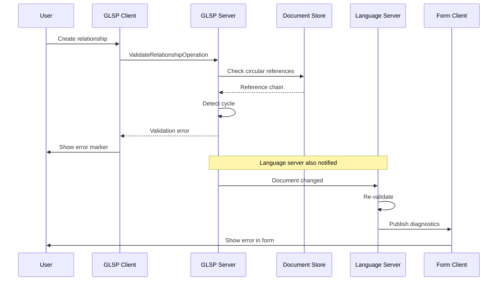

# Interface Contract Skill

## When to Use

Use this skill when:
- User story affects **both** frontend and backend components
- New RPC endpoints or messages are needed
- Shared data structures must be agreed upon
- Cross-component communication patterns must be defined

**Do NOT use this skill:**
- For frontend-only changes
- For backend-only changes with no client impact
- When modifying existing, well-defined interfaces (just follow them)

## Prerequisites

- Specification document exists (`.claude/specs/TICKET-ID-specification.md`)
- Requirements are approved
- Components affected are clearly identified (frontend + backend)

## Input Requirements

- Specification document path
- Understanding of CrossModel RPC architecture (see examples in `packages/protocol/`)

## Process

### 1. Analyze Communication Needs

From the specification, identify:
- What data flows from frontend to backend?
- What data flows from backend to frontend?
- Are there request/response pairs (RPC calls)?
- Are there notifications (one-way messages)?
- Which backend service handles each operation?
  - Language Server (LSP protocol)
  - GLSP Server (GLSP protocol)
  - Model Server (custom RPC)

### 2. Define TypeScript Interfaces

Create clear, type-safe interfaces for all data structures.

**Example Reference:** `packages/protocol/src/jsonrpc.ts`

#### Request/Response Types
```typescript
// Request payload
export interface ValidationRequest {
    /** URI of the document to validate */
    uri: string;
    /** Type of validation to perform */
    validationType: 'circular' | 'typecheck' | 'all';
    /** Optional context information */
    context?: ValidationContext;
}

// Response payload
export interface ValidationResponse {
    /** Validation errors found */
    errors: ValidationError[];
    /** Validation warnings */
    warnings: ValidationWarning[];
    /** Overall validation status */
    status: 'valid' | 'invalid' | 'warning';
}

// Supporting types
export interface ValidationError {
    /** Error message */
    message: string;
    /** Location in document */
    range: Range;
    /** Error code for programmatic handling */
    code: string;
}
```

#### Event/Notification Types
```typescript
// One-way notification from backend to frontend
export interface ModelChangeNotification {
    /** URI of changed document */
    uri: string;
    /** Type of change */
    changeType: 'created' | 'modified' | 'deleted';
    /** Affected element IDs */
    affectedElements: string[];
}
```

### 3. Define RPC Protocol Methods

Specify the method signatures for RPC communication.

#### For Model Server (Custom RPC)
Based on `packages/protocol/src/jsonrpc.ts`:

```typescript
export namespace ValidationProtocol {
    export const method = 'model/validate';

    export type Request = ValidationRequest;
    export type Response = ValidationResponse;
}
```

#### For GLSP Server
Based on GLSP protocol patterns:

```typescript
// GLSP operations follow a different pattern
export interface ValidateRelationshipOperation {
    kind: 'validateRelationship';
    relationshipId: string;
    // ... operation-specific fields
}
```

#### For Language Server (LSP)
Use standard LSP protocol when possible, or extend:

```typescript
// Custom LSP command
export namespace ValidateCircularReferences {
    export const command = 'crossmodel.validateCircular';
    export type Params = { uri: string };
    export type Result = Diagnostic[];
}
```

### 4. Document Service Responsibilities

Clearly state which backend service handles what:

```markdown
## Service Responsibilities

### Language Server
- **Handles:** Validation logic, document store updates, LSP diagnostics
- **Endpoints:**
  - `crossmodel.validateCircular` - Check for circular references
- **Notifications:**
  - Publishes LSP diagnostics on validation errors

### GLSP Server
- **Handles:** Diagram-specific operations, GModel updates
- **Operations:**
  - `validateRelationship` - Validate relationship in diagram context
- **Notifications:**
  - Updates GModel when validation state changes

### Model Server
- **Handles:** Form-based validation, model serialization
- **Methods:**
  - `model/validate` - Validate model structure
- **Notifications:**
  - `model/validationChanged` - Notify clients of validation changes
```

### 5. Create Sequence Diagrams

Use Mermaid to illustrate complex flows:



### 6. Define Validation Rules

Specify how implementations should validate adherence to the contract:

```markdown
## Validation Rules

### Type Safety
- All RPC payloads MUST match defined interfaces
- Use TypeScript's strict mode for compile-time checks
- Runtime validation recommended for external data

### Error Handling
- All RPC methods MUST handle errors gracefully
- Error responses MUST include:
  - `code`: Machine-readable error code
  - `message`: Human-readable description
  - `data` (optional): Additional context

### Error Codes
- `CIRCULAR_REFERENCE` (1001) - Circular relationship detected
- `INVALID_TYPE` (1002) - Type mismatch in relationship
- `MISSING_ENTITY` (1003) - Referenced entity not found

### Backward Compatibility
- New fields MUST be optional
- Existing fields MUST NOT change type
- Deprecated fields marked with `@deprecated` comment
```

### 7. Provide Implementation Checklist

```markdown
## Implementation Checklist

### Frontend (glsp-client, form-client)
- [ ] Import interface types from shared location
- [ ] Implement RPC call using defined method
- [ ] Handle response according to interface
- [ ] Handle all defined error codes
- [ ] Update UI based on validation response
- [ ] Subscribe to notifications

### Backend (language-server, glsp-server, model-server)
- [ ] Implement RPC method handler
- [ ] Validate request payload matches interface
- [ ] Perform operation logic
- [ ] Return response matching interface
- [ ] Publish notifications to all clients
- [ ] Add unit tests for interface compliance

### Shared
- [ ] Define interfaces in shared package (`packages/protocol/`)
- [ ] Export types for both frontend and backend use
- [ ] Document any protocol-specific quirks
```

### 8. Create Interface Contract Document

Generate `.claude/docs/interfaces/TICKET-ID-interface.md`:

**Template:**
```markdown
# [TICKET-ID] Interface Contract

## Overview
[Brief description of what this contract defines]

## Affected Components
- **Frontend:** [List packages]
- **Backend:** [List services]

## TypeScript Interfaces

### Request Types
\`\`\`typescript
[Request interface definitions]
\`\`\`

### Response Types
\`\`\`typescript
[Response interface definitions]
\`\`\`

### Shared Types
\`\`\`typescript
[Common type definitions]
\`\`\`

## RPC Protocol

### Model Server Methods
\`\`\`typescript
[Method definitions]
\`\`\`

### GLSP Operations
\`\`\`typescript
[Operation definitions]
\`\`\`

### LSP Commands
\`\`\`typescript
[Command definitions]
\`\`\`

## Service Responsibilities
[Which service handles what]

## Communication Flows

### Flow 1: [Description]
\`\`\`mermaid
[Sequence diagram]
\`\`\`

### Flow 2: [Description]
\`\`\`mermaid
[Sequence diagram]
\`\`\`

## Error Handling

### Error Codes
| Code | Name | Description | Recovery |
|------|------|-------------|----------|
| 1001 | CIRCULAR_REFERENCE | ... | ... |

### Error Response Format
\`\`\`typescript
[Error interface]
\`\`\`

## Validation Rules
[How to validate adherence]

## Implementation Notes
- [Architecture-specific considerations]
- [References to existing patterns]
- [Performance considerations]

## Testing Requirements
- [ ] Contract compliance tests
- [ ] Error handling tests
- [ ] Multi-client notification tests

## References
- Existing protocol: packages/protocol/src/jsonrpc.ts
- GLSP protocol: [GLSP docs]
- LSP protocol: [LSP specification]
```

### 9. Get User Approval

Present the interface contract to the user:
1. Show summary of defined interfaces
2. Highlight key service responsibilities
3. Show sequence diagrams
4. Ask: "Does this interface contract correctly define the communication between frontend and backend? Any changes needed?"
5. Wait for approval
6. Update if needed

## Output

- **File:** `.claude/docs/interfaces/TICKET-ID-interface.md`
- **Content:** Complete interface contract with types, protocols, and diagrams
- **Status:** User approved

## Handoff

Once approved:
- **To:** `user-story-orchestrator` (which will coordinate parallel implementation)
- **Message:** "Interface contract approved and ready for implementation."

Frontend and backend developers (skills) can now implement in parallel, following the contract.

## Context Scope

**Focus on:**
- Defining clear, type-safe interfaces
- Documenting communication patterns
- Ensuring both sides agree on data structures
- Service responsibility boundaries

**Reference:**
- `packages/protocol/src/jsonrpc.ts` - Existing RPC protocol
- `packages/glsp-client/` - How client makes RPC calls
- `extensions/crossmodel-lang/model-server/` - How server handles RPC

**Do NOT:**
- Implement the actual logic (that's for implementation skills)
- Make assumptions about internal implementation details
- Skip error handling definitions

## Examples from CrossModel

### Example 1: Model Server RPC (from protocol package)
```typescript
// packages/protocol/src/jsonrpc.ts
export interface UpdateModelRequest {
    uri: string;
    model: any;
    clientId: string;
}

export interface UpdateModelResponse {
    success: boolean;
    updatedUri?: string;
}
```

### Example 2: GLSP Operations
```typescript
// GLSP operations use a different pattern
export interface CreateEntityOperation extends Operation {
    kind: 'createEntity';
    entityType: string;
    position: Point;
}
```

### Example 3: Multi-Service Coordination
When a feature requires multiple services:
```
User creates entity in diagram
→ GLSP Client sends CreateEntityOperation to GLSP Server
→ GLSP Server updates Document Store
→ Document Store notifies Language Server
→ Language Server broadcasts to all clients
→ Form Client receives update and refreshes form
```

This multi-service dance MUST be documented in the interface contract.

---

**Remember:** A good interface contract prevents integration bugs. Invest time here to save time later.
