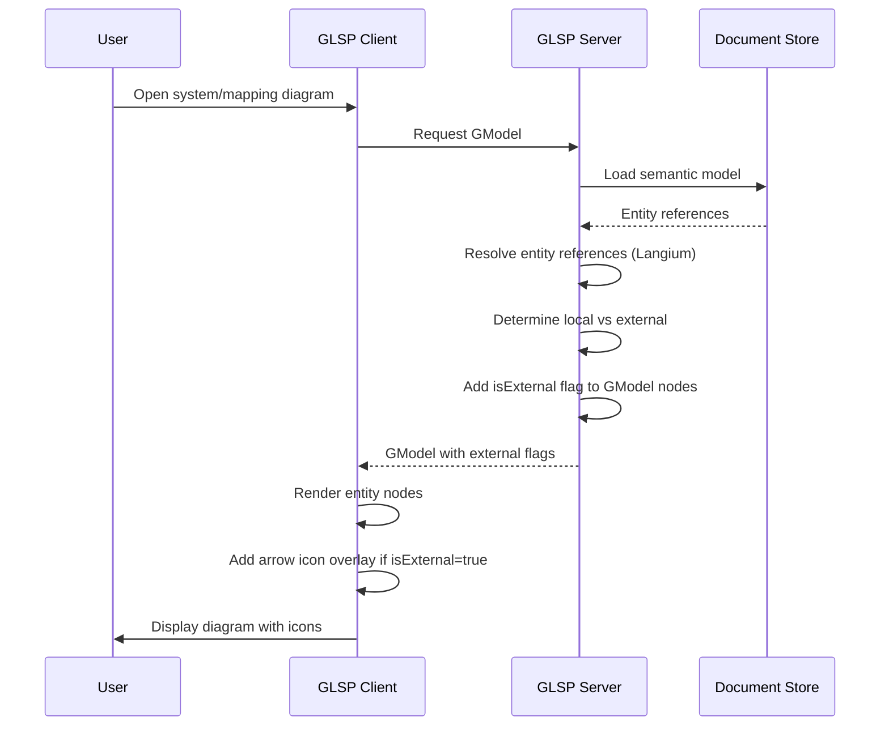

# EXTERNAL-ENTITY-ICON: Add Shortcut Icon for External Entities in Diagrams

## User Story
In system diagrams and mapping diagrams, we show entities from the current data model and also entities from other data models (within the same workspace or from npm packages). Currently it's not visible that an entity resides in a different model. Add a shortcut icon in the bottom-left corner of an entity node, comparable to shortcut icons on a Windows desktop, to indicate when an entity is external (not from the current model).

## Functional Requirements

1. **Visual Indicator for External Entities**
   - Display an arrow overlay icon in the bottom-left corner of entity nodes that are external
   - Icon should be similar to Windows shortcut arrow style
   - Icon applies to entities from:
     - Other `.entity` files in the workspace
     - npm package dependencies

2. **Diagram Coverage**
   - System diagrams: Display icon on external entities
   - Mapping diagrams: Display icon on external entities

3. **Entity Classification**
   - Use existing Langium ID reference resolution to determine if entity is local vs. external
   - Local entity: Defined in the same model file as the diagram
   - External entity: Referenced from another model file or npm package

4. **Rendering Behavior**
   - Icon scales proportionally with entity node (maintains same relative size at all zoom levels)
   - Icon always renders regardless of entity state (selected, highlighted, validation errors, etc.)
   - Icon appears on all existing diagrams automatically (no migration needed)

5. **No User Interaction**
   - Icon is purely visual (no hover tooltip, no click action)

## Technical Requirements

### Components Affected
- **Frontend:** packages/glsp-client (diagram rendering)
- **Backend:** extensions/crossmodel-lang/glsp-server (GModel generation with external entity flag)

### Data Flow

### Integration Points

**Backend (GLSP Server):**
- Enhance GModel generation to include `isExternal` boolean property on entity nodes
- Use existing Langium reference resolution to determine if entity reference is external
- Logic: Compare entity's document URI with current diagram's document URI

**Frontend (GLSP Client):**
- Update entity node view rendering
- Add arrow icon SVG overlay in bottom-left corner
- Position icon relative to node bounds (scales with zoom)
- Conditional rendering based on `isExternal` flag

## Acceptance Criteria

- [ ] Arrow icon appears on external entities in system diagrams
- [ ] Arrow icon appears on external entities in mapping diagrams
- [ ] Icon correctly distinguishes local vs. external entities using Langium reference resolution
- [ ] Icon renders correctly at all zoom levels (scales proportionally with entity node)
- [ ] Icon appears in all diagram states (selected, highlighted, with validation errors, etc.)
- [ ] Icon automatically appears on existing diagrams without migration
- [ ] Local entities (defined in current model) do NOT show the icon
- [ ] Entities from workspace files show icon
- [ ] Entities from npm packages show icon
- [ ] Icon is positioned in bottom-left corner of entity node
- [ ] Icon visual style resembles Windows shortcut arrow
- [ ] No performance degradation with large diagrams containing many external entities

## Edge Cases & Error Handling

1. **Mixed Local/External Entities:**
   - Diagram with both local and external entities should only show icon on external ones
   - Verify no visual confusion between entity types

2. **Zoom Levels:**
   - Icon remains visible and proportional at extreme zoom in/out
   - Icon doesn't overlap with entity content at any zoom level

3. **Entity States:**
   - Icon renders correctly when entity is selected (selection border doesn't hide icon)
   - Icon renders correctly when entity has validation errors
   - Icon renders correctly when entity is highlighted/hovered

4. **Performance:**
   - Reference resolution happens during GModel generation (backend)
   - Frontend only renders based on flag (no additional lookups)
   - Large diagrams with many external entities render without lag

5. **Existing Diagrams:**
   - No model migration needed
   - Icon appears automatically when diagram is opened/refreshed
   - No user action required

## Test Scenarios

### Unit Tests

**Backend (GLSP Server):**
- Test entity reference resolution identifies external entities from other workspace files
- Test entity reference resolution identifies external entities from npm packages
- Test local entities are correctly identified (same document URI)
- Test GModel includes `isExternal: true` for external entities
- Test GModel includes `isExternal: false` (or undefined) for local entities

**Frontend (GLSP Client):**
- Test arrow icon SVG is rendered when `isExternal: true`
- Test arrow icon is NOT rendered when `isExternal: false`
- Test icon positioning (bottom-left corner)
- Test icon scaling with node size

### Integration Tests

- Test system diagram displays icons on external entities
- Test mapping diagram displays icons on external entities
- Test diagram with mixed local/external entities shows icons only on external
- Test diagram with entity from npm package shows icon
- Test diagram with entity from another workspace file shows icon

### E2E Tests

**User Flow 1: Open diagram with external entities**
1. Open workspace with multiple entity files
2. Open system diagram that references entities from multiple files
3. Verify external entities show arrow icon in bottom-left corner
4. Verify local entities do NOT show arrow icon

**User Flow 2: Zoom in/out**
1. Open diagram with external entities
2. Zoom in to 200%
3. Verify arrow icon scales proportionally (remains visible and positioned correctly)
4. Zoom out to 50%
5. Verify arrow icon scales proportionally

**User Flow 3: Entity selection**
1. Open diagram with external entities
2. Select an external entity
3. Verify arrow icon remains visible with selection border
4. Select a local entity
5. Verify no arrow icon appears

**User Flow 4: Existing diagram**
1. Open existing workspace with previously created diagrams
2. Open a system diagram created before this feature
3. Verify external entities automatically show arrow icon (no migration needed)

## Implementation Notes

### Arrow Icon Visual Design
- Use SVG for scalability
- Style similar to Windows shortcut arrow:
  - Small arrow pointing up-right
  - White/light arrow with subtle shadow or border for visibility
  - Semi-transparent background box (optional)
- Size: Approximately 20-25% of entity node width
- Position: Bottom-left corner, slight padding from edges

### Reference to Existing Patterns

**GLSP Client Rendering:**
- See existing node decorators/badges in `packages/glsp-client/src/browser/diagram/`
- Follow pattern for adding visual overlays to nodes

**Langium Reference Resolution:**
- GLSP Server already uses Langium services to resolve entity references
- See `extensions/crossmodel-lang/glsp-server/src/language-server/` for integration patterns
- Access to `AstNode.$document.uri` for document URI comparison

**GModel Properties:**
- Extend existing entity node GModel type with `isExternal` boolean property
- Follow pattern in `extensions/crossmodel-lang/glsp-server/src/diagram/`

### Performance Considerations
- Reference resolution happens once during GModel generation (backend)
- Frontend rendering is simple boolean check (no expensive operations)
- Icon SVG is reusable (defined once, rendered multiple times)

## Dependencies

**Required:**
- Existing Langium reference resolution (already built)
- Existing GLSP entity node rendering (already built)

**No External Dependencies:**
- No new libraries needed
- No npm package updates required

## Estimated Complexity

- [x] Medium (multiple components, interface contract needed)

**Reasoning:**
- Frontend changes: Moderate (add icon overlay to existing node rendering)
- Backend changes: Simple (add boolean flag during GModel generation)
- Integration: Requires coordination between GLSP client and server
- Testing: Need to verify across different diagram types and zoom levels

## Next Steps

**After approval:**
1. Call `user-story-orchestrator` skill
2. Orchestrator will invoke `interface-contract` skill (frontend + backend affected)
3. Parallel implementation: `frontend-implementation` + `backend-glsp-server`
4. Integration testing: `testing-integration` skill
