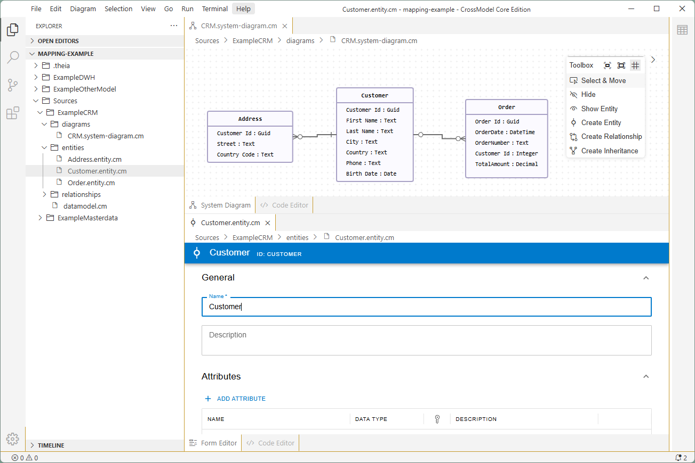
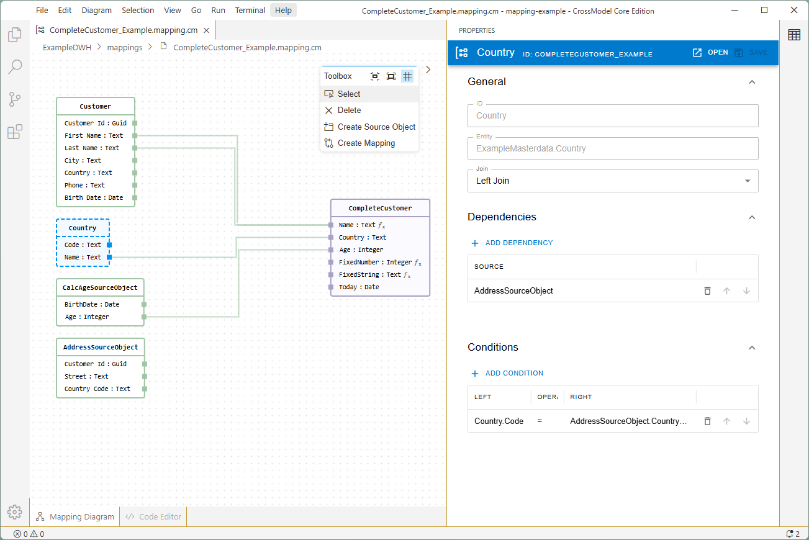

# CrossModel Core Edition

- [What is CrossModel?](#what-is-crossmodel)
- [Installation](#installation)
- [Getting started](#getting-started)
- [Contributing](#contributing)

## What is CrossModel?

CrossModel is a platform for data modeling and model-driven data engineering. It lets you define, structure, and manage your data models in a way that’s intuitive, collaborative, and automation-ready. The Core Edition is the free and open-source version. Besides the Core Edition there are also other editions with more functionality. For more information see the [CrossModel website](https://crossmodel.io).

Whether you're building a data warehouse, generating code for pipelines, or managing metadata for governance, CrossModel helps you move faster by treating your data model as the single source of truth.

With a Git-backed engine, support for custom properties, mappings, versioning, and integrated AI assistance, CrossModel bridges the gap between data design and real-world implementation.

### Data modeling

### Mapping (Data flow)

## Installation

CrossModel Core Edition is available as a desktop application for Windows, MacOS & Linux. On every release the installers are automatically created. Follow the steps below to install CrossModel Core Edition on your machine.

Steps:

- Click on the latest release under the 'Releases' topic on the right.
- On the release page, in the 'Assets' section find the installer you need and click on it to download it (you might need to login to see the files).
   - For **Windows** choose the 'Windows-X64-installer'.
   - For **MacOS**:
      - For Intel based choose 'macOS-X64-dmg-installer'.
      - For ARM based (M1, M2, etc.) choose 'macOS-AR64-dmg-installer'.
   - For **Linux**:
      - For Debian based distributions (Ubuntu, Debian, etc.) choose 'Linux-X64-deb-installer'.
      - For other distributions choose 'Linux-X64-AppImage-installer'.

> The MacOS application is not properly signed yet, which results in a error message when starting CrossModel after installation. To resolve the error you need to disable the quarantine for CrossModel. To achieve this execute the following command in the terminal after installation:
>
> `xattr -r -d com.apple.quarantine /Applications/crossmodel-core-app.app`
>
> After executing this command CrossModel should start without errors.

## Getting started

Once you start CrossModel you can open any folder to start modeling, this can either be an empty folder to create new data models or an existing CrossModel workspace folder (like [examples/mapping-example](./examples/mapping-example)).

## Contributing

Contribution are very welcome. Please read the page on contributions [here](./CONTRIBUTING.md).
